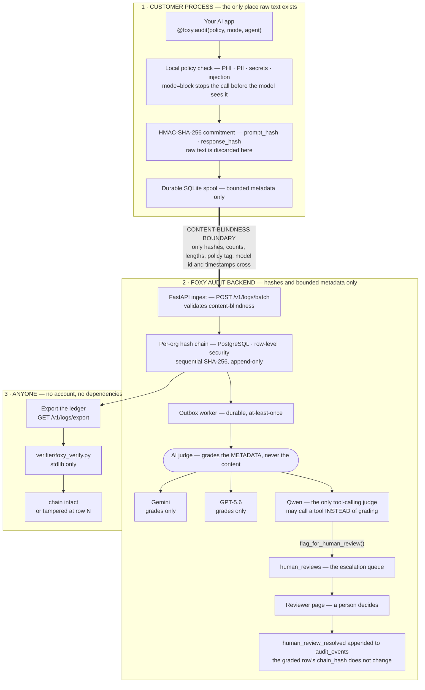

<div align="center">
  <br>

# 🦊 Foxy Audit

### Proof your AI didn't leak or tamper with data — without ever seeing the data yourself.

[](https://www.python.org/)
[](https://fastapi.tiangolo.com/)
[](https://www.postgresql.org/)
[](https://pypi.org/project/PyQt6/)
[](#how-this-was-built-with-codex--gpt-56)
[]()

**[Live app](https://app.foxyaudit.tech) · [Docs](docs/) · [Report a Bug](../../issues) · [Request a Feature](../../issues)**

<sub>🏆 An **OpenAI Build Week** submission — category **Developer Tools** · GPT-5.6 (Responses API) judge + Codex-assisted build</sub>

<sub>🏆 Submitted to the **Alibaba Cloud AI Hackathon Pakistan 2026** (Bano Qabil × Alibaba Cloud × Cognix) — track **Open Innovation** · Qwen tool-calling judge</sub>

</div>

<br>

## 🔴 The problem

AI companies selling into regulated industries — healthcare, finance, legal — constantly get asked
one question they can't answer well:

> *"Prove your AI didn't leak or alter sensitive data."*

Today there are exactly two answers: **"trust us,"** or a third-party audit that costs tens of
thousands of dollars and takes months. Neither one actually gives the buyer proof — just a promise,
or a snapshot in time that's stale the moment it's signed.

## 🟢 The idea

Foxy Audit replaces the promise with math. Every AI interaction gets a cryptographic fingerprint,
computed **locally, on the developer's own machine** — the raw prompt and response are hashed and
discarded immediately, never transmitted anywhere. Each fingerprint is chained sequentially, so
altering any historical record breaks every hash that comes after it. Anyone — an auditor, a buyer,
a skeptic — can independently recompute and verify the whole chain themselves, without trusting our
servers, our database, or our word for anything.

> **The one sentence that matters:** every competing AI governance tool needs to see your data to
> govern it. Foxy Audit proves integrity without ever holding what was said.

<br>

> ### 🧑‍⚖️ Judging this? Start here.
> **What it is, in two sentences.** Foxy Audit is a content-blind, tamper-evident audit-evidence
> platform for AI systems in regulated industries. A Python SDK commits each prompt and response to a
> keyed hash on the developer's own machine and ships only bounded metadata to a hash-chained ledger —
> so a hospital, a bank, or an auditor can independently verify that an AI interaction happened and
> was not altered, without anyone (us included) ever holding what was said.
>
> **Two commands, from the repo root.** These need no account, no API key and no network:
> ```bash
> python demo/offline_demo.py --output-dir out
> python verifier/foxy_verify.py out/foxy-audit-export.json
> ```
> The first builds a chain, checks the customer-owned commitments, and edits one historical row so you
> can watch tamper detection fire. The second recomputes that chain from the export alone — a
> different program, no shared state, zero dependencies — and prints
> `[OK] chain intact - 3 rows verified from genesis`.
>
> Now make it fail. The demo also wrote a pre-tampered copy; point the same verifier at it:
> ```bash
> python verifier/foxy_verify.py out/tampered-export.json
> # [FAIL] CHAIN BROKEN at seq 2 - chain hash mismatch at seq 2
> ```
>
> **The full stack** is a separate step, and unlike the two above it *does* pull and build images:
> ```bash
> cd backend
> docker compose up --build -d
> docker compose logs foxy-seed          # your API key prints here
> ```
> Longer paths: [Quickstart](#-quickstart) · [Verifying it actually works](#-verifying-it-actually-works) ·
> [Architecture](#-architecture).
>
> ⚠️ **`JUDGES.html`, `JUDGES.pdf` and `FoxyAudit-How-We-Build.pdf` are not part of this submission.**
> See [Artefacts from earlier submissions](#-artefacts-from-earlier-submissions) — they describe
> different events and are kept only as a record.

<br>

## 📑 Table of contents

- [For judges](#-judging-this-start-here)
- [Submission — Alibaba Cloud AI Hackathon Pakistan 2026](#-submission--alibaba-cloud-ai-hackathon-pakistan-2026)
- [How it's different](#-how-its-different)
- [Architecture](#-architecture)
- [Quickstart](#-quickstart)
- [Verifying it actually works](#-verifying-it-actually-works)
- [How this was built with Codex / GPT-5.6](#-how-this-was-built-with-codex--gpt-56)
- [What was built with Qwen](#-what-was-built-with-qwen)
- [Artefacts from earlier submissions](#-artefacts-from-earlier-submissions)
- [Project status](#-project-status)
- [Roadmap](#-roadmap)
- [Security](#-security)
- [License](#-license)

<br>

## 🇵🇰 Submission — Alibaba Cloud AI Hackathon Pakistan 2026

**Event:** Alibaba Cloud AI Hackathon Pakistan 2026 (Bano Qabil × Alibaba Cloud × Cognix).
**Track:** **Open Innovation.**

**Why this fits Open Innovation.** Foxy Audit isn't an assistant or a vertical app — it's
infrastructure for a problem that currently has no good answer. A small AI company selling into a
hospital or a bank gets asked *"prove your model didn't leak or alter this data"*, and today the only
replies are "trust us" or a five-figure third-party audit. The interesting constraint is that the
proof has to be produced **without reading the thing being proved about**: the evidence must be
strong enough for an auditor and blind enough that no regulated data ever moves. That constraint is
what shapes every design decision below, including the Qwen integration — an LLM asked to reason
about an interaction it is deliberately not allowed to see, and given the option to say so.

**Demonstrated, not asserted.** `python demo/mock_llm.py --scenario all` drives the host-side guard
against a mock LLM — no key, no network, though it does need the SDK on your path first
(`pip install -e ./sdk`, see [Quickstart](#-quickstart)) — and prints a PASS/FAIL table over the five cases in
`demo/mock_llm.py`: a benign prompt, **PHI** under `hipaa`, **PII** under `gdpr`, a prompt-injection
attempt, and a leaked API key. Each blocked case shows the prompt being stopped *before* the model
call. The SDK ships four policy tags — `hipaa` (PHI + PII), `gdpr` (PII), and `soc2` and `default`,
which run the secrets-and-injection baseline alone. There is no finance-specific ruleset today, so
healthcare and general PII are the domains this demo actually proves.

**What the AI judge actually judges.** It grades **metadata** — hashes, counts, lengths, the policy
tag, the model id, timestamps. It never receives the prompt or response text, in any provider, on any
code path. That is enforced by an allowlist validator on ingest (`_metadata_is_content_blind` in
[`backend/app/schemas.py`](backend/app/schemas.py)) and by a shared projection every judge call goes
through (`content_blind_meta` in [`backend/app/judge.py`](backend/app/judge.py)).

**Where Alibaba Cloud is used, and where it isn't.** Two separate things, and it is worth being
exact about which is which.

*The Alibaba Cloud usage is real, and it is the interesting part.* The agentic compliance judge in
[`backend/app/qwen_judge.py`](backend/app/qwen_judge.py) calls **Alibaba Cloud Model Studio** (Qwen)
at `https://dashscope-intl.aliyuncs.com/compatible-mode/v1`, over stdlib `urllib` against the
OpenAI-compatible `/chat/completions` endpoint — no new dependency. It is the only one of the three
judge providers given **tools**: `flag_for_human_review`, which routes an interaction to a person and
produces `decision="human_review"`, and `check_prior_reviews`, which reads back what people already
ruled on that policy tag. So the model does not merely answer the question; it decides whether it
should be the one answering, and it may consult the humans who answered before it.

*The hosting is **Google Cloud**, not Alibaba Cloud.* The live instance runs
`deploy/docker-compose.alibaba.yml` on the project's existing GCE VM as a third isolated stack
alongside production. An Alibaba Cloud ECS instance was scoped and then not purchased, so this
README does not claim an Alibaba Cloud deployment and neither should anything else. The deploy
config and the full procedure are in
[`deploy/ALIBABA_SUBMISSION_RUNBOOK.md`](deploy/ALIBABA_SUBMISSION_RUNBOOK.md).

Everything described in this README also runs locally with `docker compose`.

<br>

## ⚖️ How it's different

| | Sees your raw prompts/responses? | What you get |
|---|:---:|---|
| **AI gateways** (route/proxy your live traffic) | Yes — has to, to route it | Traffic control, cost management |
| **Observability platforms** (ingest calls to scan them) | Yes — their own docs require publishing prompts/responses to their system | Hallucination/toxicity detection |
| **Governance/compliance platforms** (policy documentation) | No, but produces paperwork, not runtime proof | Policy templates, risk frameworks |
| **Foxy Audit** | **Never, for any feature, ever** | **Cryptographic, independently-verifiable proof of integrity** |

We're not a bigger version of any of these. We're the layer none of them provide: mathematical
proof of what happened, generated without ever holding what was said.

<br>

## 🏗 Architecture

The one line that matters is the **content-blindness boundary**: raw prompt and response text is
committed to a keyed hash inside the customer's own process and discarded there. It never crosses.
Everything below the boundary — the chain, the AI judge, the escalation queue, the export — operates
on hashes and bounded metadata alone.

<!-- Standalone copy for the submission form: docs/architecture.svg (it paints its own
     surface, so it reads identically on GitHub light and dark). -->



A standalone, higher-detail version lives at **[`docs/architecture.svg`](docs/architecture.svg)**.

Two components sit alongside the path above rather than on it: the **PyQt6 desktop companion**
(`desktop/`), which the SDK pings over UDP so a block raises a card on the developer's screen, and
**`anchor.py`**, optional EVM/Sepolia anchoring of the chain head.

<details>
<summary>The original ASCII sketch (kept for reference — it predates the Qwen judge and the review queue)</summary>

```
+-----------------------+        UDP ping         +------------------------+
|   Your AI app          | ----------------------> |  Desktop Companion      |
|   + Foxy SDK            |                          |  (PyQt6, real-time      |
|   (@foxy.audit(...))    |                          |   green/red reaction)   |
+-----------+-------------+                          +------------------------+
            |  hash + metadata only
            |  (raw text discarded locally)
            v
+-----------------------------------------------------------------------+
|                     FastAPI + PostgreSQL Backend                        |
|                                                                           |
|   chain.py         -> sequential SHA-256 hash chain (tamper-evident)    |
|   judge.py          -> combines Gemini + GPT-5.6 verdicts conservatively|
|   policy_engine.py  -> evaluates metadata against org policy config     |
|   anchor.py         -> optional EVM/Sepolia public chain anchoring      |
+-----------------------------------------------------------------------+
            |
            v
+-------------------------+      +----------------------------------+
|   Web Dashboard           |      |   Standalone Verifier              |
|   Ledger, Threats,        |      |   verifier/foxy_verify.py           |
|   Policy, Verify,         |      |   Dependency-free. Recomputes       |
|   Compliance Passport     |      |   the entire chain from scratch --  |
|   export                  |      |   trusts nothing from our servers.  |
+-------------------------+      +----------------------------------+
```

</details>

**Three integration points, in order of how most people touch this product:**

1. **Developer** adds one line to existing code (`pip install foxy-audit`):
```python
   from foxy_audit import FoxyClient
   foxy = FoxyClient(api_key=os.getenv("FOXY_API_KEY"))

   # mode="block" runs a local policy check FIRST — PHI/PII, secrets, and
   # prompt-injection are caught and the call is blocked before the prompt ever
   # leaves the machine. mode="redact" scrubs them; the default just records.
   @foxy.audit(policy="hipaa", mode="block", agent="gpt-5.6")
   def call_llm(user_prompt: str):
       return real_llm_call(user_prompt)
```
2. **Compliance officer / founder** logs into the web dashboard — no install, just a browser — to
   review the ledger or export a one-click Compliance Passport for a buyer.
3. **Anyone skeptical** runs the standalone verifier against an exported ledger, with zero
   dependencies and zero trust required in Foxy's own infrastructure.

<br>

## 🚀 Quickstart

```bash
# 1. Backend
cd backend
docker compose up --build -d
docker compose logs foxy-seed          # copy the API key printed here

# 2. Desktop companion (separate terminal)
cd ../desktop
pip install -r requirements.txt
python omni_fox.py

# 3. SDK (separate terminal)
cd ..
pip install -e ./sdk
export FOXY_API_KEY="paste-key-here"
python demo/run_demo.py
```

One command health check — backend connectivity, desktop pet detection, and chain verification,
end to end:
```bash
foxy doctor
```

<br>

## ✅ Verifying it actually works

This is the test that matters — not "does it run," but "does it do the specific thing it claims."

```bash
# Export the ledger
curl -H "Authorization: Bearer $FOXY_API_KEY" \
  "http://127.0.0.1:8000/v1/logs/export?format=json" -o foxy-audit-logs.json

# Verify independently -- trusts nothing from our servers, recomputes from scratch
python verifier/foxy_verify.py foxy-audit-logs.json
# -> chain intact -- N rows verified from genesis
```

**Now break it on purpose.** Open the export, change one character in any historical row's
`response_hash` or `chain_hash`, save it, and re-run the verifier. It must report that exact row as
tampered — and everything chained after it as invalid too. If it still says "intact" after your
edit, the core claim of this product is false. This is the single most important test in this repo.

**No OpenAI key? Two dependency-free demos a judge can run in seconds:**
```bash
python demo/offline_demo.py             # build a chain, verify it, watch tamper detection fire
python demo/mock_llm.py --scenario all  # drive the host-side guard with a mock LLM (block/redact)
```
For the full live GPT-5.6 path, `demo/live_openai_client.py` makes a real Responses API call wrapped
by `@foxy.audit` — see [docs/OPENAI_BUILD_WEEK_SUBMISSION.md](docs/OPENAI_BUILD_WEEK_SUBMISSION.md).

### End-to-end, on a running stack

```bash
python e2e/run_e2e.py
```

One command. It brings the compose stack up, drives the SDK **as `pip install` produces it** over
real HTTP, waits for the grading worker, asserts the customer API, and signs into the dashboard in a
real browser to screenshot the ledger. Exit code 0 = pass; the last line is a machine-readable
`E2E_SUMMARY {...}`.

Its most valuable assertion is that the raw prompt and response text appear **nowhere** — not in any
`/v1/*` body, not in the export bundle, not in **any column of any table**, not in the rendered
dashboard DOM — checked with distinctive sentinel strings, alongside a negative control that fails
the run if the search itself stops working.

[e2e/README.md](e2e/README.md) says what it proves **and what it does not**. The second half is the
shorter read and the more useful one.

<br>

## 🤖 How this was built with Codex / GPT-5.6

The core hashing, chaining, and verification logic in this repo predates this hackathon — it was
built and independently verified (including the live tamper-detection test above) before the
submission window opened. In the interest of being precise about what's new vs. what existed, here
is exactly what was built or meaningfully extended with Codex/GPT-5.6 during the submission period:

- **`backend/app/judge.py`** — a multi-provider AI judge that runs GPT-5.6 (OpenAI Responses API)
  alongside the existing Gemini evaluator and combines their verdicts conservatively: if either
  provider flags a policy breach, or the two disagree, the combined result treats it as a breach
  rather than silently trusting a "clean" verdict. `judge.validate()` also quarantines an empty or
  self-contradictory model answer as `evaluator_unknown` instead of laundering it into a grade.
- **`sdk/src/foxy_audit/policy.py` + `client.py`** — the **host-side preflight guard**. With
  `mode="block"` / `"redact"`, the SDK runs a local policy check (PHI/PII, secrets, prompt-injection)
  *before* the wrapped model call and blocks or scrubs the prompt on the host — the content-blind
  `blocked`/`redacted` events are graded terminally, never sent to a judge.
- **`backend/app/crypto_secrets.py` + `judge_routing.py`** — **per-tenant AI-judge selection**: each
  org picks its judge/provider and can bring its own API key, encrypted at rest with a rotatable
  Fernet key and bound to `(org_id, provider)` so a stored blob can't be replayed across tenants.
  Keys are decrypted in memory only at grading time and never returned, logged, or chained.

Every change was made by giving Codex full context of the existing codebase first, having it
propose an approach before generating code, and reviewing every diff before accepting it.

**Codex Session ID:** `019f720b-52aa-78d3-a57f-655a8ba3731f`

<br>

## 🐉 What was built with Qwen

The section above is true and stays as written — the hashing, chaining and verification core predates
both submission windows, and the GPT-5.6 judge and host-side guard were built in the earlier one.
Here is the equivalent list for **this** window (2026-09-04 → 2026-09-05), in the order it was built.
Everything named is in the repo and runnable.

- **`backend/app/qwen_judge.py` — Qwen as a third judge provider, and the only agentic one.** The
  other two providers can only score an event. This one is given a tool, `flag_for_human_review`, and
  may call it *instead of* returning a grade — so the model decides whether it should be the one
  deciding at all. Transport is stdlib `urllib` against Qwen's OpenAI-compatible `/chat/completions`
  endpoint, deliberately adding no new dependency. A tool call is optional and cannot break grading:
  a malformed call degrades to the ordinary JSON path, and only then to the same honest "nothing
  graded this row" the other providers return. Shipped as Q1–Q4 (`779b8ed`, `9a40181`, `04ae280`,
  `7fa7f30`, `c9d5ba5`, `1de4dd1`).
- **The escalation criterion, rewritten after it was measured (`9f9bacc`).** The first version of the
  tool description said to call it "when the metadata is genuinely ambiguous". Against the live API,
  both `qwen-plus` and `qwen-max` then graded *everything* and never escalated — an LLM asked whether
  it feels uncertain will nearly always find a rationale not to be. The escalation path, which is the
  entire point of the provider, was unreachable in practice. The fix states **checkable** conditions
  in terms of the fields the model actually receives, and draws the line by capability rather than
  confidence: escalate where a reviewer who *can* see the content could decide something a
  content-blind model structurally cannot. A regression test pins that the prompt keeps a checkable
  trigger.
- **The escalation queue — migrations `0072`/`0073` (`7f56f3a`).** A `human_reviews` table plus
  `GET /v1/reviews` and `POST /v1/reviews/{review_id}/resolve`
  ([`backend/app/routers/reviews.py`](backend/app/routers/reviews.py)). Resolving appends an
  append-only `AuditEvent(event_type="human_review_resolved")` **beside** the graded row; the
  `chain_hash` of the row it concerns does not change. A human's word is annotation, not a rewrite —
  otherwise a reviewer could silently alter evidence, which is the one thing this product exists to
  prevent.
- **The reviewer page — migration `0074` (`7b0deb3`).** The escalation queue rendered in the customer
  dashboard, so an escalation reaches a person whether or not the notification email arrived. `0074`
  turns the notice gate into a column, which makes a dropped notice recoverable rather than lost.

**One honest distinction from the Codex section above.** There, Codex/GPT-5.6 was the tool that helped
*write* the code. Here, Qwen is the model *integrated into the product* — the agentic judge — not the
assistant that authored the diffs. The work above was built with Claude Code, every diff read before
it was accepted, as the rest of this repo was. Calling this "built with Qwen" in the authorship sense
would be the wrong claim, and a submission about tamper-evidence is a poor place to make one.

The escalation-criterion bug is the clearest argument for reading the diffs anyway: it looked correct,
passed its tests, and only failed when it was run against the real API.

<br>

## 📊 Project status

**Genuinely working, verified directly against the code:**
- ✅ Local hashing, zero raw-text transmission
- ✅ Sequential hash chain with confirmed tamper detection
- ✅ **Host-side preflight guard** — block/redact PHI/PII/secrets/injection *before* the LLM call
- ✅ Multi-provider AI judge (Gemini + GPT-5.6), per-tenant with encrypted bring-your-own keys
- ✅ Row-Level Security enforced via a non-superuser application role
- ✅ Real signup → API key → email flow via Stripe webhook
- ✅ Standalone, dependency-free verifier script
- ✅ Compliance Passport with host-side enforcement counts
- ✅ SDK published to PyPI (`pip install foxy-audit`)
- ✅ Admin IP allow-list fails closed in production
- ✅ Legal pages (Terms, Privacy) — real content, not placeholders

**Honestly still open:**
- ⏳ The preflight guard covers the **SDK-wrapped** path; a network-level gateway/sidecar to also
  catch calls that bypass the SDK is future work, not a hidden gap
- ⏳ Desktop/mobile installers (signed `.exe`, notarized `.dmg`, Linux AppImage) not yet built

<br>

## 🗺 Roadmap

1. **Network-level gateway / sidecar** — observe traffic at the model boundary so even calls that
   bypass the SDK decorator are captured (closes the completeness gap noted above).
2. Policy versioning (each event tagged with the exact policy version + hash it was checked against)
3. No-login auditor verification portal
4. Evidence API so governance platforms can pull our proof directly

*(Zero-knowledge proof extensions are a genuine long-term direction, not a near-term promise.)*

<br>

## 📁 Artefacts from earlier submissions

Three files in this repo were written for **different events** and are **not part of this
submission**. They are kept rather than deleted because they are an accurate record of what was
submitted where, and quietly removing them would be the same kind of history-editing this product
exists to make detectable. Do not read them as describing the Alibaba Cloud AI Hackathon Pakistan
2026 entry:

| File | Written for | Status |
|---|---|---|
| `JUDGES.html` / `JUDGES.pdf` | **OpenAI Build Week** — its judge testing guide, including that event's evaluation accounts | Superseded. For this submission, use [Judging this? Start here](#-judging-this-start-here) above. |
| `FoxyAudit-How-We-Build.pdf` | **Build with Gemini · XPRIZE** — a narrative "how we build" piece, dated 2026-08-18 | Superseded, and describes the team rather than the product. |

Nothing in this README depends on any of them.

<br>

## 🔒 Security

Found a vulnerability? Please don't open a public issue — email
**security@foxyaudit.tech**.

The published policy is <https://foxyaudit.tech/report-abuse.html>: safe harbour
for good-faith research, what is in and out of scope, and no bounty or response
time we cannot keep. [`SECURITY.md`](SECURITY.md) adds the repository-side view.

<br>

## 📜 License

Foxy Audit is released under the **MIT License** — see [`LICENSE`](LICENSE). The
Python SDK is published to PyPI as [`foxy-audit`](https://pypi.org/project/foxy-audit/)
under the same licence, and ships [`sdk/LICENSE`](sdk/LICENSE) in the sdist.

MIT permits commercial use, modification and redistribution, with the copyright
notice retained. It is also irrevocable for every version already published.
